# Terraform
learn infrastructure as Code

## Traditional Infrastructure management approach:
1. Manual console management - web based interface, point and click, form based configuration
2. Script based automation - shell scripts with CLI commands, custom automation for repetitive task.
3. Manual monitoring and maintenance - manual health check, troubleshooting when problem arise.

### Disadvantages:

1. Error prone process.
2. Inconsistency.
3. More time required.
4. Scaling challenges(adding new resources requires repeating manual process).
5. Limited collaboration.
6. No change tracking.
7. Poor documentation(configuration exist only in peoples mind).

## **TERRAFORM:**
- Terraform is an open source Infrastructure as Code tool developed by Hashicrop.
- It allows you to define, provision(process of creating and setting up environment) and manage the cloud and on-premises infrastructure using an Configuration Language.

### advantages:

- Support multi cloud (AWS, Azurerm, GCP, etc,.).
- Plan before apply.
- State mangement.

## What is Infrastructure as Code?
The Process of managing and provisioning the cloud resources through the machine-readable definition files, rather than physical hardware configuration.

### Key benifits:
+ consistency - same infra every time.
+ Version control - Track changes like application code.
+ Automation - reduce manual error.
+ Scalablity - easy to replicate accross the environment.
+ Documentation - Infrastructure becomes self documenting.

## HCL(Hashicrop Configuration Language)

- A domain specific language used to define infrastructure as code, primarly tools like Terraform, OpenTofu.
- It is designed to be human-readable while enabling structured data generation.

## Terraform Workflow:

1. Init:
    + to prepare the current working directory for use with Terraform.
    + download providers and initialize backend.
2. Validate:
    + Validate the syntax and configuration of Terraform files.
3. Plan:
    + Create an execution plan showing what Terraform will do.
    + Shows what resources will be created, modified, or destroyed.
    + Builds dependency graph to determine execution order.
    ### output symbols
    * "+" = Resource will be created.
    * "~" = Resource will be modified.
    * "-" = Resource will be destroyed
4. Apply:
    + Apply the changes required to reach the desired state.
    + Updates the state file with current infrastructure state.
5. Destroy:
    + Destroy all resources managed by Terraform.
    + Removes resources in reverse dependency order.
    + Updates state file to reflect destroyed resources

## How terraform works?

<p align="center">
  
</p>

1. Terraform configuration file:
    + Terraform configuration file contains definiton of Infrastructure as Code resources that terraform will manage.
    + This file is written in HCL which is designed to be human-readable and easy to write.
    + It uses ***.tf*** file extension.

2. Terraform Core:
    + Terraform core is statically compiled binary written in "GO" language.
    + It uses RPC(Remote Procedure calls) to communicate with terraform plugins.
    + The compiled binary is a command line tool called ***terraform***.

3. Terraform State file:
    + State file are crucial for terraform operations and track the current state of your infrastructure.
    + Maintains records of what terraform created and manages.
    + contains sensitive data, requiring careful security considerations.

4. Terraform Providers:
    + Terraform providers are plugins that enables terraform to interact with the cloud platform through the APIs.
    + Plugins authentication with infrastructure provider.
    + defines managed resources and data sources that map to specific services.

## API(Application Programming Interface):

+ API is a set of rules and protocols that allows different software to communicate with each other.
+ It defines how requests and responses should be structured between systems, acting ike intermediatory that enables different programs to interact and exchange data.

## Provider:
- Provider are plugin that enables terraform to interact with cloud services providers.
- They act as a bridge between Terraform and External systems that you want to manage.
- Providers are declared in Terraform using a provider block, where configuration settings such as access keys, credentials, and regions are specified.

### What provider do:
1. Download - while we run ***terraform init*** command it downloads the required plugin to communicate.
2. Authenticate - With the cloud services provider based on credentials (environment variables, config files, etc.).
3. Translate - It converts HCL (HashiCorp Configuration Language) configuration into API calls for the target platform.

### How the Provider Works:

```mermaid
graph TD
    A[HCL Configuration] --> B[Terraform Core<br/>RPC]
    B --> C[AWS Provider Plugin]
    C --> D[AWS API Calls<br/>Translate HCL → API]
    D --> E[Create/Manage<br/>AWS Resources]
```


### Example:

```
    provider <"aws"> {
        region = <region>
        # defining security credentials in provider is not good practice. use config file/set them as env
        access_key = <access key id>
        secret_key = <secret key>
    }
```

## Variables:
- Variables are the primary way to parameterize the terraform configuration.
- They act as a parameters to customize the infrastructure without modifying the original code.
- This make the code more flexible and reusable.
- There are two types of variables. they are 
    1. Input variables.
    2. Output variables.

### Why variables?

- **Seperation of configuration & code** - Infrastructure code logic and environment variable are seperated(eg: region, secret_key, access_key, etc)
- **Reuseability** - if we required infra with instance specific or other just provide instance type as a value for variable.
- **Security** - sensitive data like password can be kept outside from main code.
- **Clarity** - explicitly configure input that required.

### Variables Declaration:

```
variable "var_name" {
    type = var_type
    description = "short definition"
    default = "to set default value of var. if user not provided"

    validation{
        condition = "to verify correct input"
        error_message = "if condition not satisfied give error message"
    }
}
```

### Key Arguments inside the variable block:

* type (Optional): The data type of the variable. Common types are:
    * string: e.g., "us-east-1"
    * number: e.g., 8080, 1.5
    * bool: true or false
    * list(<TYPE>) or tuple([<TYPES>]): e.g., list(string) = ["sg-123", "sg-456"]
    * set(<TYPE>): Like a list, but with unique, unordered elements.
    * map(<TYPE>) or object({...}): e.g., map(string) = { Name = "Web", Env = "prod" }
    * any: A placeholder for a type that is not yet known.
* default (Optional): The default value if no value is provided. If omitted, the variable is required.
* description (Optional): A human-friendly description of the variable's purpose. Highly recommended!
* validation (Optional): A block to define custom validation rules for the variable.
* sensitive (Optional): If set to true, Terraform will obscure the variable's value in plan and apply output logs.